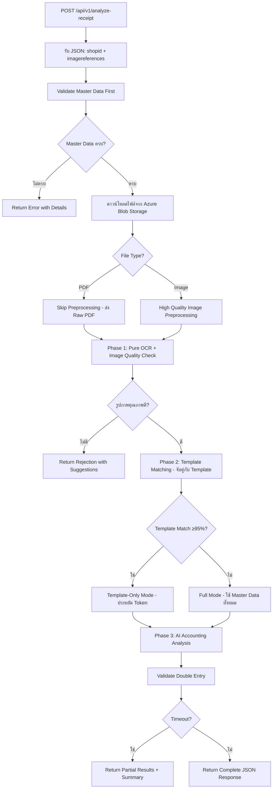
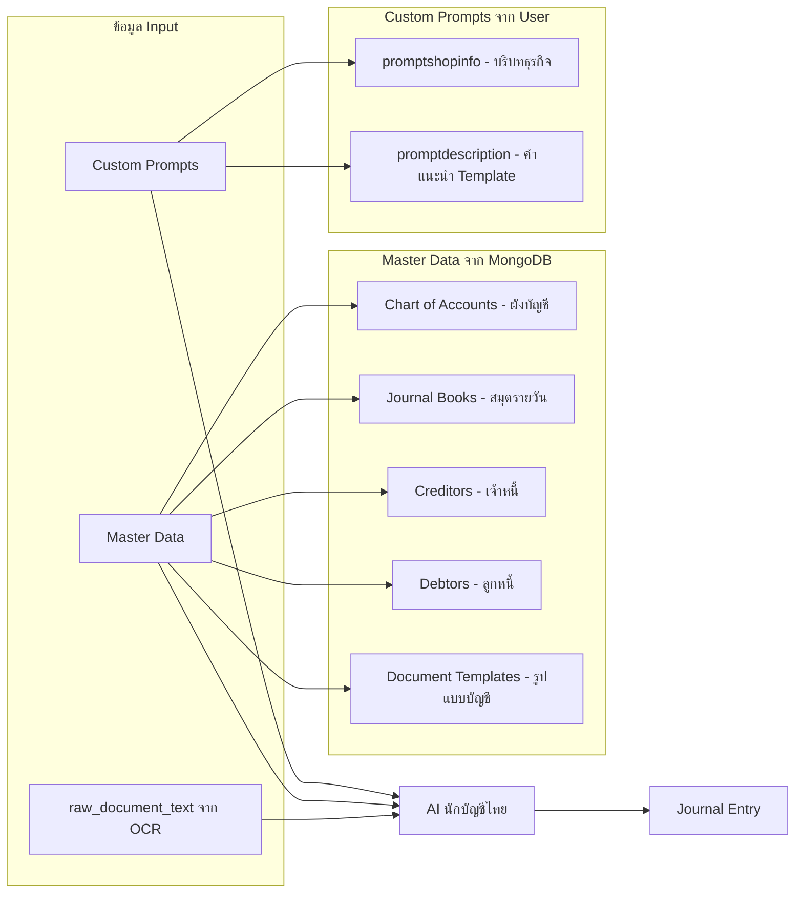

# Bill Scan API - ระบบวิเคราะห์ใบเสร็จอัตโนมัติ

## 🎯 ภาพรวม

ระบบ **Bill Scan API** เป็น REST API สำหรับวิเคราะห์ใบเสร็จ/ใบกำกับภาษีโดยใช้ **Google Gemini AI** ในการ OCR และสร้างบันทึกบัญชี (Journal Entry) อัตโนมัติ

---

## 🔄 Flow การทำงานหลัก



---

## 📁 โครงสร้างไฟล์หลัก

| ไฟล์ | หน้าที่ |
|------|---------|
| `cmd/api/main.go` | Entry point - เริ่ม Gin server, CORS, Routes, Graceful Shutdown |
| `configs/config.go` | โหลด config จาก .env (API Key, MongoDB, Timeout) |
| `internal/api/handlers.go` | Handler หลัก - จัดการ request/response, Image Quality Validation |
| `internal/api/request_context.go` | Request Context สำหรับ tracking และ logging |
| `internal/common/request_context.go` | Shared request context utilities |
| **📝 AI Prompt Management** | |
| `internal/ai/prompt_ocr.go` | 🔍 **Prompt สำหรับ Pure OCR** - อ่านข้อความดิบจากเอกสาร |
| `internal/ai/prompt_accountant.go` | 🧮 **System Instruction สำหรับนักบัญชี AI** - กฎและหลักการทางบัญชี |
| `internal/ai/prompts.go` | 📋 Master Data Formatting - จัดรูปแบบข้อมูลหลักส่งให้ AI |
| **🤖 AI Processing** | |
| `internal/ai/gemini.go` | เรียก Gemini API สำหรับ OCR และวิเคราะห์บัญชี |
| `internal/ai/gemini_retry.go` | Retry logic สำหรับ Gemini API (จัดการ 429, 500 errors) |
| **🔧 Processing & Storage** | |
| `internal/processor/template_matcher.go` | จับคู่เอกสารกับ Template ที่กำหนดไว้ (ใช้ AI) |
| `internal/processor/imageprocessor.go` | Image Preprocessing (High Quality Mode) + PDF Pass-through |
| `internal/storage/mongodb.go` | เชื่อมต่อ MongoDB + Query ข้อมูล |
| `internal/storage/cache.go` | Cache Master Data (TTL 5 นาที) |
| `internal/ratelimit/rate_limiter.go` | Rate Limiting สำหรับ Gemini API |

---

## 🧠 AI Prompts แบ่งตามหน้าที่ (Separation of Concerns)

### 1️⃣ Prompt OCR (Pure OCR) - อ่านข้อความดิบ

**ไฟล์**: `internal/ai/prompt_ocr.go`  
**ฟังก์ชัน**: `GetPureOCRPrompt()`

**หน้าที่**:
- อ่านข้อความทั้งหมดจากรูปภาพหรือ PDF เป็น **raw_document_text**
- รองรับทั้ง Image files (JPEG, PNG) และ PDF files (รวมทั้ง multi-page PDFs)
- ไม่วิเคราะห์ ไม่แยกโครงสร้าง ไม่ทำความเข้าใจ
- แค่อ่านทุกตัวอักษรที่เห็นแล้วส่งกลับเป็นข้อความดิบ
- ประหยัด Token: ~82% เทียบกับแบบเดิมที่ให้ AI แยกโครงสร้างด้วย

**หลักการ**:
- อ่านจากบนลงล่าง, ซ้ายไปขวา
- เก็บข้อความดิบๆ ไม่จัดรูปแบบ
- ระมัดระวังเลข 0 นำหน้า (008131560570)
- ใช้บริบทช่วยคาดเดาอักษรไทยที่ไม่ชัด

**Output Schema**: 
```json
{
  "status": "success",
  "raw_document_text": "ข้อความทั้งหมดจากเอกสาร",
  "metadata": { "model_name": "gemini-2.5-flash" }
}
```

---

### 2️⃣ System Instruction สำหรับนักบัญชี AI

**ไฟล์**: `internal/ai/prompt_accountant.go`  
**ฟังก์ชัน**: `BuildAccountantSystemInstruction(shopContext, templateGuidance)`

**หน้าที่**: กำหนด Rules และหลักการทางบัญชีให้ AI ปฏิบัติตาม

**ลำดับความสำคัญ (Priority)**:
1. **Shop Context** (บริบทธุรกิจ) - Always Applied
   - มาจาก `promptshopinfo` ใน collection `shops`
   - เช่น: "ธุรกิจร้านอาหาร ไม่จดทะเบียน VAT"
   
2. **Template Guidance** (คำแนะนำเฉพาะ Template) - When Template Matched
   - มาจาก `promptdescription` ใน collection `documentFormate`
   - มีอำนาจสูงสุด - Override ทุก Rule
   - เช่น: "ใช้ยอดรวมไปเลย ไม่ต้องบันทึกภาษีซื้อ"

3. **Primary Rules** (กฎทางบัญชี)
   - Rule #0: Withholding Tax Certificates (สูงสุด)
   - Rule #1: Template Enforcement
   - Rule #2: Master Data Validation
   - Rule #3: Double Entry Validation
   - Rule #4: Withholding Tax Handling ⭐ **สำคัญ!**
   - Rule #5: VAT Handling
   - Rule #6: Creditor/Debtor Matching (Fuzzy ≥70%)
   - Rule #7: Journal Book Selection
   - Rule #8: Documentation & Explanations

**ตัวอย่าง Rule #4 - Withholding Tax Handling**:
```
เมื่อพบ "ภาษีหัก ณ ที่จ่าย":
- ถ้า Template บอกให้บันทึก → บันทึกเป็นรายการแยก
- ถ้า Template บอก "ใช้ยอดรวมไปเลย" → ตรวจสอบว่ามีคำว่า 
  "ไม่ต้องบันทึกภาษีหัก ณ ที่จ่าย" หรือไม่
  - ถ้าไม่มี → ต้องบันทึก! (ภาษีหัก ≠ ภาษีซื้อ)
  
สูตร:
Dr. Expense = Total BEFORE withholding
Dr./Cr. Withholding Tax = Tax Amount
Cr. Cash = Amount Actually Paid
```

---

### 3️⃣ Master Data Formatting

**ไฟล์**: `internal/ai/prompts.go`  
**ฟังก์ชัน**: `BuildMultiImageAccountingPrompt()`, `formatMasterDataWithMode()`

**หน้าที่**: จัดรูปแบบข้อมูลหลัก (Master Data) เพื่อส่งให้ AI

**2 Modes**:
- **Template-Only Mode**: ส่งเฉพาะ Template ที่ Match (~7,000 tokens)
- **Full Mode**: ส่ง Chart of Accounts ทั้งหมด (~30,000 tokens)

**ข้อมูลที่รวม**:
- Chart of Accounts (ผังบัญชี)
- Journal Books (สมุดรายวัน)
- Creditors/Debtors (รายชื่อผู้ขาย/ลูกค้า)
- Document Templates (Template บัญชี)
- Shop Profile (ข้อมูลธุรกิจ)
- Fuzzy Matching Guidelines (≥70%)

---

## 📊 ข้อมูลที่ AI ใช้ตัดสินใจ



---

## 🔑 Custom Prompts ทำงานอย่างไร

### `promptshopinfo` (จาก collection `shops`)

**ใช้ตรงไหน**: ส่งเป็น **Shop Context** ใน System Instruction (บรรทัด 879-889 ใน gemini.go)

**ตัวอย่าง**: 
```
ธุรกิจร้านอาหาร รายได้หลักจากขายอาหาร วัตถุดิบหลักคือเนื้อสัตว์และผัก
```

**ผลกระทบ**: AI จะรู้ว่าธุรกิจทำอะไร → เลือก Account ที่เหมาะสม
- เช่น ซื้อไก่ในร้านอาหาร → บันทึกเป็น "ต้นทุนอาหาร" ไม่ใช่ "วัสดุสิ้นเปลือง"

### `promptdescription` (จาก collection `documentFormate`)

**ใช้ตรงไหน**: ส่งเป็น **Template Guidance** ใน System Instruction (บรรทัด 894-917 ใน gemini.go)

**ตัวอย่าง**: 
```
ยอดจ่ายชำระต้องหักยอดภาษี หัก ณ ที่จ่าย: เงินสด = ยอดรวม - ภาษีหัก
```

**ผลกระทบ**: AI จะทำตามสูตรที่กำหนด
- เช่น Template บอกให้คำนวณ → AI จะคำนวณ (แม้ปกติจะห้ามคำนวณเอง)

---

## 📋 ลำดับความสำคัญของ Rules

```
1️⃣ Template Guidance (promptdescription) - สูงสุด
      ↓
2️⃣ Shop Context (promptshopinfo) - บริบทธุรกิจ
      ↓
3️⃣ Template Rules - ต้องใช้ Account ครบตาม Template
      ↓
4️⃣ Master Data - ใช้เฉพาะ Account ที่มีใน DB
      ↓
5️⃣ Accounting Standards - หลักบัญชีทั่วไป
```

**ถ้า Template Guidance บอกให้ทำอะไร → AI ต้องทำตาม แม้จะขัดกับ Rule อื่น**

---

## 🗃️ Master Data จาก MongoDB

| Collection | ใช้ทำอะไร | จำเป็น |
|------------|----------|--------|
| `shops` | ข้อมูลร้านค้า + promptshopinfo (บริบทธุรกิจ) | ✅ Required |
| `chartofaccounts` | ผังบัญชี (Account Code + Name) | ✅ Required |
| `journalBooks` | สมุดรายวัน (02=ซื้อ, 03=ขาย, 01=ทั่วไป) | ✅ Required |
| `creditors` | รายชื่อเจ้าหนี้/ผู้ขาย (รองรับ Fuzzy Matching ≥70%) | ⚠️ Optional แต่แนะนำ |
| `debtors` | รายชื่อลูกหนี้/ลูกค้า (สำหรับใบขาย/ใบวางบิล) | ⚠️ Optional |
| `documentFormate` | Template บัญชีที่กำหนดไว้ล่วงหน้า (ช่วยประหยัด token) | ⚠️ Optional แต่แนะนำ |

---

## 🔄 3 Phases ของ AI Processing

### Phase 1: Pure OCR + Image Quality Validation
- **ฟังก์ชัน**: `ProcessPureOCR()` (OCRProvider interface)
- **OCR Providers** (Request-based selection via `model` field in request body):
  - **Mistral OCR** (`mistral.go`):
    - โมเดล: mistral-ocr-latest (mistral-ocr-2512)
    - ราคา: $2 per 1,000 pages (฿0.07/page)
    - URL-based: รับ URL ของเอกสารโดยตรง ไม่ต้องดาวน์โหลด
    - รองรับ: PDF URLs, Image URLs (HTTPS)
    - ข้อจำกัด: ไม่รองรับ PDF เป็น base64
  - **Gemini OCR** (`gemini.go`):
    - โมเดล: gemini-2.5-flash-lite
    - ราคา: Token-based ($0.10/1M input, $0.40/1M output)
    - File-based: ดาวน์โหลดและ preprocess ก่อนส่ง
    - รองรับ: PDF, JPEG, PNG (ทั้ง local และ URL)
- **การเลือก Provider**: Frontend ส่ง `"model": "gemini"` หรือ `"model": "mistral"` ใน request body
- อ่านข้อความดิบจากรูปภาพหรือ PDF ทั้งหมด (raw_document_text)
- **รองรับ File Types**:
  - **PDF Files** (application/pdf): Mistral ใช้ URL โดยตรง, Gemini ส่ง raw bytes
  - **Image Files** (JPEG, PNG): ทั้งสอง provider รองรับ
- ประหยัด token ~82% เทียบกับการให้ AI แยกโครงสร้างทันที
- Return: `raw_document_text` + cost metadata (pages หรือ tokens)
- **Sequential Processing**: ประมวลผลทีละไฟล์เพื่อหลีกเลี่ยง Rate Limit

### Phase 2: Template Matching (AI-Driven)
- **ฟังก์ชัน**: `AnalyzeTemplateMatch()` (template_matcher.go)
- ใช้ **Gemini AI** วิเคราะห์ raw_document_text + template descriptions
- AI เลือก template ที่เหมาะสมพร้อมให้เหตุผล (reasoning)
- ถ้า Confidence ≥95% → **Template-Only Mode** (ประหยัด ~20,000 tokens ใน Phase 3)
- ถ้า < 95% → **Full Mode** (ส่ง Chart of Accounts ทั้งหมดให้ AI)
- รองรับ `promptdescription` จาก Template สำหรับคำแนะนำเฉพาะ

### Phase 3: Accounting Analysis (Multi-Image/PDF Support)
- **ฟังก์ชัน**: `ProcessMultiImageAccountingAnalysis()` (gemini.go)
- รวมข้อมูลจากหลายไฟล์ (เช่น ใบเสร็จ PDF + สลิปโอนเงิน Image)
- รองรับการผสมไฟล์ทั้ง PDF และ Image ในคำขอเดียวกัน
- สร้าง Journal Entry ตาม:
  - Template (Template-Only Mode) หรือ
  - Master Data + Accounting Rules (Full Mode)
- Validate: 
  - Debit = Credit (tolerance 0.01 บาท)
  - Account Code ต้องมีใน Master Data
  - Balance Check + Error Handling
- รองรับ **Timeout 5 นาที** พร้อม Partial Results สำหรับใบเสร็จซับซ้อน

---

## 🎯 ลำดับการตัดสินใจของ AI

1. **AI อ่าน OCR** → ได้ข้อความดิบจากเอกสาร
2. **ดู promptshopinfo** → รู้ว่าธุรกิจทำอะไร (ร้านอาหาร? ค้าปลีก? บริการ?)
3. **Template Matching** → หา Template ที่ตรงกับเอกสาร
4. **ถ้ามี Template + promptdescription** → ทำตามคำแนะนำใน Template
5. **ถ้าไม่มี Template** → ใช้ Master Data + หลักบัญชีไทย
6. **สร้าง Journal Entry** → Debit/Credit ตามหลักบัญชี
7. **Validate** → เช็ค Balance, Account Code ถูกต้อง

---

## 🔑 ความสามารถพิเศษ

1. **PDF Native Support** - รองรับ PDF โดยตรงผ่าน Gemini API โดยไม่ต้องแปลงเป็นรูปภาพ
2. **Image Quality Validation** - ตรวจสอบคุณภาพรูปภาพก่อนประมวลผล พร้อม Rejection Response แบบละเอียด
3. **High Quality Image Preprocessing** - ปรับปรุงรูปภาพด้วย Sharpen, Contrast, Brightness เพื่อความแม่นยำสูงสุด
4. **Template Enforcement** - ถ้าใช้ Template ต้องใช้ Account ครบตาม Template
5. **AI-Driven Template Matching** - ใช้ Gemini AI เลือก Template อัจฉริยะพร้อมเหตุผล
6. **Fuzzy Matching** - จับคู่ชื่อเจ้าหนี้/ลูกหนี้แม้สะกดต่างกัน (≥70%)
7. **Multi-Image/PDF Support** - รวมข้อมูลจากหลายไฟล์ (เช่น ใบเสร็จ PDF + สลิปโอนเงิน Image)
8. **Smart Rate Limiting** - Retry logic อัตโนมัติสำหรับ 429, 500 errors (exponential backoff)
9. **Sequential Processing** - ป้องกัน 429 Error ด้วยการประมวลผลทีละไฟล์ (1 worker)
10. **Graceful Timeout** - 5 นาที timeout พร้อม Partial Results Summary
11. **Request Context Tracking** - ติดตาม request ID และ processing steps สำหรับ debugging
12. **In-Memory Cache** - Cache Master Data 5 นาที (auto-reload เมื่อหมดอายุ)
13. **JSON Escaping Fix** - แก้ไขปัญหา JSON formatting จาก Gemini API อัตโนมัติ

---

## 📤 ตัวอย่าง Request

### Request แบบ Image

```bash
POST /api/v1/analyze-receipt
Content-Type: application/json

{
  "shopid": "shop-123",
  "imagereferences": [
    {
      "documentimageguid": "img-001",
      "imageuri": "https://storage.azure.com/container/receipt.jpg"
    }
  ]
}
```

### Request แบบ PDF

```bash
POST /api/v1/analyze-receipt
Content-Type: application/json

{
  "shopid": "shop-123",
  "imagereferences": [
    {
      "documentimageguid": "pdf-001",
      "imageuri": "https://storage.azure.com/container/receipt.pdf"
    }
  ]
}
```

### Request แบบผสม (PDF + Image)

```bash
POST /api/v1/analyze-receipt
Content-Type: application/json

{
  "shopid": "shop-123",
  "imagereferences": [
    {
      "documentimageguid": "pdf-001",
      "imageuri": "https://storage.azure.com/container/receipt.pdf"
    },
    {
      "documentimageguid": "img-002",
      "imageuri": "https://storage.azure.com/container/slip.jpg"
    }
  ]
}
```

---

## 📥 ตัวอย่าง Response

```json
{
  "status": "success",
  "receipt": {
    "number": "INV-001",
    "date": "16/12/2025",
    "vendor_name": "บริษัท ABC จำกัด",
    "vendor_tax_id": "1234567890123",
    "total": 2140.00,
    "vat": 140.00
  },
  "accounting_entry": {
    "journal_book_code": "02",
    "journal_book_name": "สมุดรายวันซื้อ",
    "creditor_code": "CR001",
    "creditor_name": "บริษัท ABC จำกัด",
    "entries": [
      {
        "account_code": "533020",
        "account_name": "ค่าธรรมเนียม-ค่าที่ปรึกษาบัญชี",
        "debit": 2000.00,
        "credit": 0.00,
        "description": "ค่าทำบัญชีประจำเดือน",
        "selection_reason": "ค่าทำบัญชี",
        "side_reason": "ค่าใช้จ่ายเพิ่มขึ้นลง DR"
      },
      {
        "account_code": "115810",
        "account_name": "ค่าภาษีซื้อ",
        "debit": 140.00,
        "credit": 0.00,
        "description": "ภาษีมูลค่าเพิ่ม",
        "selection_reason": "ภาษีซื้อ",
        "side_reason": "สินทรัพย์เพิ่มขึ้นลง DR"
      },
      {
        "account_code": "111110",
        "account_name": "เงินสดในมือ",
        "debit": 0.00,
        "credit": 2140.00,
        "description": "จ่ายเงินสด",
        "selection_reason": "ชำระด้วยเงินสด",
        "side_reason": "เงินสดลดลงลง CR"
      }
    ],
    "balance_check": {
      "balanced": true,
      "total_debit": 2140.00,
      "total_credit": 2140.00
    }
  },
  "template_info": {
    "template_used": true,
    "template_name": "ค่าทำบัญชี",
    "template_id": "tmpl-001",
    "confidence": 95
  },
  "validation": {
    "overall_confidence": {
      "level": "high",
      "score": 95
    },
    "requires_review": false
  },
  "metadata": {
    "request_id": "req-001",
    "processed_at": "2025-12-16T02:12:00Z",
    "duration_sec": 15.5,
    "cost_thb": 2.50,
    "images_processed": 1
  }
}
```

---

## ⚙️ Environment Variables สำคัญ

| Variable | ค่า Default | คำอธิบาย |
|----------|-------------|----------|
| **OCR Provider Configuration** | | |
| `MISTRAL_API_KEY` | (required) | API Key สำหรับ Mistral AI |
| `MISTRAL_MODEL_NAME` | mistral-ocr-latest | โมเดล Mistral OCR (mistral-ocr-2512) |
| `GEMINI_API_KEY` | (required) | API Key สำหรับ Gemini (OCR + Template + Accounting) |
| | | **หมายเหตุ**: OCR provider เลือกโดย frontend ผ่าน `model` field ใน request |
| **Phase-Specific Models** | | |
| `OCR_MODEL_NAME` | gemini-2.5-flash-lite | โมเดล OCR (Phase 1) - เน้นความแม่นยำไทย |
| `TEMPLATE_MODEL_NAME` | gemini-2.5-flash-lite | โมเดล Template Matching (Phase 2) |
| `TEMPLATE_ACCOUNTING_MODEL_NAME` | gemini-2.5-flash-lite | โมเดล Accounting (Template-only ≥95%) |
| `ACCOUNTING_MODEL_NAME` | gemini-2.5-flash | โมเดล Accounting (Full analysis <95%) |
| `MODEL_NAME` | gemini-2.5-flash-lite | (Deprecated) Backward compatibility |
| **Pricing Configuration** | | |
| `OCR_INPUT_PRICE_PER_MILLION` | 0.10 | ราคา OCR input (USD/1M tokens) |
| `OCR_OUTPUT_PRICE_PER_MILLION` | 0.40 | ราคา OCR output (USD/1M tokens) |
| `TEMPLATE_INPUT_PRICE_PER_MILLION` | 0.10 | ราคา Template input (USD/1M tokens) |
| `TEMPLATE_OUTPUT_PRICE_PER_MILLION` | 0.40 | ราคา Template output (USD/1M tokens) |
| `TEMPLATE_ACCOUNTING_INPUT_PRICE_PER_MILLION` | 0.10 | ราคา Template Accounting input |
| `TEMPLATE_ACCOUNTING_OUTPUT_PRICE_PER_MILLION` | 0.40 | ราคา Template Accounting output |
| `ACCOUNTING_INPUT_PRICE_PER_MILLION` | 0.30 | ราคา Full Accounting input (USD/1M tokens) |
| `ACCOUNTING_OUTPUT_PRICE_PER_MILLION` | 2.50 | ราคา Full Accounting output (USD/1M tokens) |
| `USD_TO_THB` | 36.0 | อัตราแลกเปลี่ยน USD เป็น THB |
| **MongoDB & Server** | | |
| `MONGO_URI` | mongodb://localhost:27017 | Connection String MongoDB |
| `MONGO_DB_NAME` | smldevdb | ชื่อ Database |
| `PORT` | 8080 | Port ที่ Server ทำงาน |
| `UPLOAD_DIR` | uploads | โฟลเดอร์เก็บไฟล์ชั่วคราว (auto-cleanup) |
| `ALLOWED_ORIGINS` | * | CORS allowed origins (ควรตั้งค่าเฉพาะเจาะจงใน production) |
| `GIN_MODE` | debug | Gin mode: debug หรือ release |
| `ENABLE_IMAGE_PREPROCESSING` | true | เปิดใช้งาน High Quality Image Preprocessing |
| `MAX_IMAGE_DIMENSION` | 2000 | ขนาดรูปสูงสุด (pixels) |
| `PARALLEL_PROCESSING` | false | ปิดใช้งาน (ใช้ Sequential เพื่อหลีกเลี่ยง 429 Error) |

---

## 🏗️ การติดตั้งและใช้งาน

### 1. Clone โปรเจ็กต์
```bash
git clone <repository-url>
cd bill_scan_project
```

### 2. ติดตั้ง Dependencies
```bash
go mod download
```

### 3. ตั้งค่า Environment Variables
สร้างไฟล์ `.env`:
```bash
GEMINI_API_KEY=your_gemini_api_key
MONGO_URI=mongodb://your_mongo_connection
MONGO_DB_NAME=your_db_name
PORT=8080
```

### 4. รัน Server
```bash
go run cmd/api/main.go
```

### 5. ทดสอบ API
```bash
curl -X POST http://localhost:8080/api/v1/analyze-receipt \
  -H "Content-Type: application/json" \
  -d @test_request.json
```

---

## 📚 API Endpoints

### `POST /api/v1/analyze-receipt`

**หน้าที่**: วิเคราะห์ใบเสร็จและสร้างบันทึกบัญชี

**Request Body**:
```json
{
  "shopid": "string (required)",
  "imagereferences": [
    {
      "documentimageguid": "string",
      "imageuri": "string (required)"
    }
  ]
}
```

**Response**: JSON object ที่มี:
- `status`: "success" | "error"
- `receipt`: ข้อมูลใบเสร็จที่แยกได้
- `accounting_entry`: รายการบัญชีที่สร้าง
- `validation`: ข้อมูลการตรวจสอบ
- `template_info`: ข้อมูล Template ที่ใช้
- `metadata`: ข้อมูลเพิ่มเติม (request_id, ค่าใช้จ่าย, etc.)

---

## 🛠️ การแก้ไขปัญหา

### Rate Limiting (429 Error)
- ระบบใช้ **Sequential Processing** (1 worker) เพื่อหลีกเลี่ยง 429 Error
- มี **Automatic Retry** พร้อม Exponential Backoff (รอ 10-30 วินาที)
- Gemini Free Tier: 15 RPM (4 วินาทีต่อ request)
- หากยังเจอ 429: ลด concurrent requests หรืออัพเกรด Tier

### Master Data ไม่ครบ
- ระบบจะตรวจสอบ **ก่อนประมวลผล AI** เพื่อประหยัด tokens
- ข้อมูลที่จำเป็น (Required):
  - `chartofaccounts`: ผังบัญชี (ต้องมีอย่างน้อย 1 รายการ)
  - `journalBooks`: สมุดรายวัน (ต้องมีอย่างน้อย 1 รายการ)
  - `shops`: ข้อมูลร้านค้า + promptshopinfo
- ข้อมูล Optional (แนะนำให้มี):
  - `creditors`: รายชื่อเจ้าหนี้ (ช่วย Fuzzy Matching)
  - `debtors`: รายชื่อลูกหนี้ (สำหรับใบขาย)
  - `documentFormate`: Template บัญชี (ประหยัด ~20,000 tokens)
- Response จะแจ้งข้อมูลที่ขาดชัดเจน

### Template ไม่ Match
- เพิ่ม `documentFormate` ใน MongoDB
- ตั้งค่าให้ครบ:
  - `description`: ชื่อ Template (เช่น "ค่าทำบัญชี")
  - `promptdescription`: คำแนะนำการบันทึกบัญชี
  - `details`: รายละเอียด Account ที่ใช้
- ทดสอบด้วย debug mode: `?debug=true`
- AI จะให้ `reasoning` อธิบายว่าทำไมเลือก Template นี้

### Image Quality ไม่ผ่าน
- ถ่ายรูปในที่แสงสว่างเพียงพอ
- ให้กล้องโฟกัสก่อนถ่าย
- วางเอกสารบนพื้นผิวเรียบ
- หลีกเลี่ยงเงาและแสงสะท้อน
- ระบบจะแจ้ง `issues` ที่เจอชัดเจน

### Processing Timeout
- ใบเสร็จที่มี 50+ รายการอาจใช้เวลานาน
- ถ่ายรูปให้ชัดเพื่อลดเวลาประมวลผล
- พิจารณาแบ่งใบเสร็จยาวเป็นหลายส่วน
- ระบบจะส่ง Partial Results พร้อม Summary

---

## �️ Image Quality Validation

ระบบตรวจสอบคุณภาพรูปภาพอัตโนมัติก่อนประมวลผล AI เพื่อป้องกันการสิ้นเปลือง tokens กับรูปภาพที่ไม่สามารถอ่านได้

### เกณฑ์การตรวจสอบ

| เกณฑ์ | ค่าขั้นต่ำ | คำอธิบาย |
|-------|-----------|----------|
| **Text Clarity Score** | 70% | ความชัดเจนของข้อความในเอกสาร |
| **Handwriting Confidence** | 85% | ความมั่นใจในการอ่านลายมือ (ถ้ามี) |
| **Overall Confidence** | 70% | ความมั่นใจโดยรวมในการแยกข้อมูล |

### Rejection Response

หากรูปภาพไม่ผ่านเกณฑ์ ระบบจะส่ง Response แบบละเอียด:

```json
{
  "status": "rejected",
  "reason": "image_quality_insufficient",
  "message": "รูปภาพไม่ผ่านเกณฑ์คุณภาพ กรุณาถ่ายรูปใหม่",
  "failed_images": [
    {
      "documentimageguid": "img-001",
      "image_index": 0,
      "imageuri": "https://...",
      "issues": [
        {
          "field": "text_clarity",
          "issue": "Text is too blurry or low contrast",
          "current_value": "45%",
          "min_required": "70%"
        }
      ]
    }
  ],
  "suggestions": [
    "ถ่ายรูปในที่มีแสงสว่างเพียงพอ",
    "ให้กล้องโฟกัสก่อนถ่าย",
    "วางเอกสารบนพื้นผิวเรียบ"
  ],
  "request_id": "req-xxx",
  "total_images": 2,
  "failed_count": 1
}
```

### ประโยชน์

- **ประหยัด Tokens**: ไม่ส่งรูปภาพคุณภาพต่ำไปให้ AI ประมวลผล
- **User Experience**: แจ้งปัญหาและวิธีแก้ไขชัดเจน
- **Accuracy**: ป้องกันผลลัพธ์ที่ไม่แม่นยำจากรูปภาพไม่ชัด

---

## ⏱️ Timeout & Graceful Handling

ระบบมี Timeout 5 นาทีสำหรับใบเสร็จที่ซับซ้อน (50+ รายการ)

### Timeout Response

หากประมวลผลเกิน 5 นาที ระบบจะส่ง Partial Results:

```json
{
  "error": "Processing timeout",
  "message": "Receipt is too complex and processing exceeded 5 minutes",
  "details": "This usually happens with very long receipts (50+ items) or low-quality images",
  "suggestions": [
    "Try taking a clearer photo with better lighting",
    "Ensure the receipt is flat and fully visible",
    "Consider splitting very long receipts into sections"
  ],
  "request_id": "req-xxx",
  "processing_summary": {
    "timeout_at": "5 minutes",
    "total_duration": 300.5,
    "completed_steps": [
      "download_images: success",
      "pure_ocr_extraction_all: success",
      "template_matching: success",
      "accounting_analysis: timeout"
    ]
  }
}
```

### Server Timeouts

```go
ReadTimeout:  3 seconds   // รับ request
WriteTimeout: 3 minutes   // ส่ง response (ให้เวลา AI ประมวลผล)
```

---

## 📝 Request Context & Logging

ระบบใช้ **Request Context** สำหรับ tracking และ debugging

### Features

- **Request ID**: UUID สำหรับติดตามแต่ละ request
- **Step Tracking**: บันทึกทุก step พร้อม duration
- **Structured Logging**: Log แบบมีโครงสร้างชัดเจน
- **Token Usage Tracking**: ติดตามการใช้ tokens แต่ละ phase

### ตัวอย่าง Log

```
[INFO] 🚀 เริ่มรับคำขอใหม่ | ShopID: shop-123 | RequestID: req-xxx
[INFO] ✓ Master data validated: 150 accounts, 3 journal books, 45 creditors
[INFO] 📸 Image size: 2.5 MB (2621440 bytes)
[INFO] ✓ Pure OCR completed: 1250 tokens used
[INFO] 📋 Template matched: "ค่าทำบัญชี" (95% confidence)
[INFO] ✓ Accounting analysis completed: 3500 tokens used
[INFO] ✅ Request completed: 15.5s total, 4750 tokens
```

---

## �🔍 Debug Mode

เพิ่ม parameter `?debug=true` เพื่อดูข้อมูลเพิ่มเติม:
- Pure OCR Results (raw text)
- Template Matching Results
- Token Usage
- Processing Steps

```bash
curl "http://localhost:8080/api/v1/analyze-receipt?debug=true" \
  -X POST \
  -H "Content-Type: application/json" \
  -d @request.json
```

---

## 📈 ประสิทธิภาพ

### Token Usage

| Phase | Token Usage | หมายเหตุ |
|-------|-------------|----------|
| **Phase 1: Pure OCR** | ~1,000-1,500 | อ่านข้อความดิบเท่านั้น |
| **Phase 2: Template Matching** | ~800-1,200 | AI เลือก Template |
| **Phase 3: Accounting (Template Mode)** | ~2,000-3,000 | ใช้ Template เฉพาะ |
| **Phase 3: Accounting (Full Mode)** | ~20,000-25,000 | ส่ง Chart of Accounts ทั้งหมด |
| **Total (Template Mode)** | ~4,000-6,000 | ประหยัด 82% |
| **Total (Full Mode)** | ~22,000-28,000 | สำหรับใบเสร็จที่ไม่มี Template |

### Processing Time

- **ใบเสร็จทั่วไป** (1-10 รายการ): 15-30 วินาที
- **ใบเสร็จซับซ้อน** (10-50 รายการ): 30-90 วินาที
- **ใบเสร็จยาวมาก** (50+ รายการ): 2-5 นาที (อาจ timeout)
- **Sequential Processing**: เพิ่มเวลา ~4 วินาทีต่อรูป (ป้องกัน 429 Error)

### Accuracy

- **ใบเสร็จชัดเจน**: >95% accuracy
- **ใบเสร็จไม่ชัดเล็กน้อย**: 85-95% accuracy
- **ใบเสร็จไม่ชัดมาก**: Rejected ด้วย Image Quality Validation
- **Handwritten Documents**: ต้อง confidence ≥85%

### Rate Limits (Gemini Free Tier)

- **15 Requests Per Minute (RPM)**
- Sequential Processing: ~4 วินาทีต่อรูป → ปลอดภัยจาก 429 Error
- Automatic Retry: รอ 10-30 วินาทีถ้าเจอ 429
- แนะนำอัพเกรด Tier หากต้องการ parallel processing

### Cache Performance

- **Master Data Cache**: TTL 5 นาที
- **Hit Rate**: ~90% สำหรับ requests ต่อเนื่อง
- **Auto-Reload**: โหลดใหม่อัตโนมัติเมื่อหมดอายุ
- **Memory Usage**: ~1-5 MB ต่อ shop

---

## 📞 การสนับสนุน

หากมีปัญหาหรือข้อสงสัย:
1. ตรวจสอบ logs ใน terminal
2. เปิด debug mode เพื่อดูรายละเอียด
3. ตรวจสอบ MongoDB connection
4. ตรวจสอบ Gemini API Key

---

## 📦 โครงสร้าง Prompt Management (v2.1)

### ก่อนปรับปรุง (Old - v1.0)
```
internal/ai/
├── prompt_ocr_simple.go     # OCR Prompt
├── prompts.go               # Master Data + Rules + Format (รวมกัน 1,617 บรรทัด)
└── gemini.go               # API + System Instruction (ซ้ำ)
```
❌ **ปัญหา**: ไฟล์ prompts.go ใหญ่เกินไป ยากต่อการแก้ไขและไล่อ่าน

### หลังปรับปรุง (New - v2.1) ✨
```
internal/ai/
├── 🔍 prompt_ocr.go              # Pure OCR - อ่านข้อความดิบ (~220 lines)
├── 🧮 prompt_accountant.go       # System Instruction - กฎนักบัญชี (~250 lines)
├── 📏 prompt_rules.go            # Analysis Rules - หลักการวิเคราะห์ (~60 lines)
├── 🔄 prompt_multiimage.go       # Multi-Image Steps - ขั้นตอนหลายรูป (~80 lines)
├── 📤 prompt_output_format.go    # JSON Schema & Validation (~400 lines)
├── 📌 prompt_guidelines.go       # Additional Guidelines - คำแนะนำเพิ่มเติม (~60 lines)
├── 📋 prompts.go                 # Master Data Formatting เท่านั้น (~850 lines)
└── 🤖 gemini.go                  # API Calls (~1,072 lines)
```
✅ **ประโยชน์**: แยกตามบทบาท ง่ายต่อการแก้ไขและบำรุงรักษา

### ประโยชน์ของการแยก Prompt Files

✅ **Separation of Concerns** - แต่ละไฟล์มีหน้าที่ชัดเจน  
✅ **ง่ายต่อการแก้ไข** - แก้ Prompt OCR ไม่กระทบ Accountant Rules  
✅ **ทดสอบง่าย** - Test แต่ละส่วนแยกกันได้  
✅ **Reusable** - ใช้ซ้ำได้ในหลาย context  
✅ **Version Control** - เห็น history การเปลี่ยนแปลงชัดเจน  
✅ **ไล่อ่านง่าย** - ไม่ต้องเลื่อนไฟล์ 1,600+ บรรทัด  
✅ **แก้ไขปลอดภัย** - แก้ไข Rules ไม่กระทบ Output Format  

### รายละเอียดแต่ละไฟล์ Prompt

| ไฟล์ | บรรทัด | หน้าที่ | ตัวอย่าง |
|------|--------|---------|----------|
| `prompt_ocr.go` | ~220 | อ่านข้อความดิบจากเอกสาร | "อ่านทุกตัวอักษรที่เห็น..." |
| `prompt_accountant.go` | ~250 | System Instruction + 8 Rules | Rule #4: Withholding Tax |
| `prompt_rules.go` | ~60 | หลักการวิเคราะห์ | "ใช้บริบทธุรกิจ..." |
| `prompt_multiimage.go` | ~80 | ขั้นตอนหลายรูป | "เอกสาร + สลิป" |
| `prompt_output_format.go` | ~400 | JSON Schema + Validation | ทศนิยม 2 ตำแหน่ง |
| `prompt_guidelines.go` | ~60 | คำแนะนำเพิ่มเติม | "วิธีตรวจจับการชำระเงิน" |
| `prompts.go` | ~850 | Master Data Formatting | Template Mode vs Full Mode |  

### สัดส่วน Prompt (Token Distribution)

| Component | Tokens | เปอร์เซ็นต์ |
|-----------|--------|-----------|
| **OCR Prompt** | ~500 | 2% |
| **System Instruction** | ~2,000 | 8% |
| **Master Data (Template Mode)** | ~7,000 | 30% |
| **Master Data (Full Mode)** | ~30,000 | 90% |
| **Response** | ~1,500 | 5-10% |

**💡 Optimization Strategy**: ใช้ Template Mode เมื่อ confidence ≥95% เพื่อประหยัด ~80% tokens

---

## 📊 สรุปการปรับปรุง v2.1 (16 ธ.ค. 2568)

### ✨ สิ่งที่เปลี่ยนแปลง

1. **แยก prompts.go (1,617 บรรทัด) → 7 ไฟล์**
   - ลด code smell จากไฟล์ใหญ่เกินไป
   - แยกตามหน้าที่: OCR, Accountant, Rules, Multi-Image, Format, Guidelines

2. **เพิ่ม Rule #4: Withholding Tax Handling**
   - แก้ไขปัญหา Balance ไม่เท่ากันในใบเสร็จค่าโทรศัพท์
   - อธิบายชัดเจนว่าต้องบันทึกภาษีหัก ณ ที่จ่ายเมื่อไหร่

3. **ปรับปรุงโครงสร้างเอกสาร**
   - เพิ่มตารางเปรียบเทียบก่อน-หลัง
   - อธิบายประโยชน์ของการแยกไฟล์
   - เพิ่มรายละเอียดแต่ละไฟล์

### 🎯 ผลลัพธ์

- ✅ Build สำเร็จ (3,223 บรรทัดรวม)
- ✅ แยกบทบาทชัดเจน (Separation of Concerns)
- ✅ ง่ายต่อการบำรุงรักษา (Maintainability)
- ✅ ลดความซับซ้อน (Reduced Complexity)

---

## 📄 PDF Support

ระบบรองรับ PDF โดยตรงผ่าน Gemini API โดยไม่ต้องแปลงเป็นรูปภาพ

### ความสามารถ

- ✅ รองรับทั้ง PDF และ Image (JPG, PNG) ในคำขอเดียวกัน
- ✅ ตรวจจับ file type อัตโนมัติจาก Content-Type header
- ✅ ส่ง PDF ไปยัง Gemini API โดยตรง (MIME type: `application/pdf`)
- ✅ รองรับ multi-page PDFs (Gemini ประมวลผลทุกหน้า)
- ✅ ไม่มีการ preprocess PDF (ส่งไฟล์ดิบ)

### การทำงาน

1. **Download Phase**: ตรวจจับ Content-Type เป็น `application/pdf`
2. **Preprocessing Phase**: ข้าม image preprocessing สำหรับ PDF
3. **OCR Phase**: ส่ง raw PDF bytes ไปยัง Gemini API
4. **Analysis Phase**: ประมวลผลตามปกติเหมือน Image

### ข้อจำกัด

- PDF Size Limit: ~20MB (ข้อจำกัดของ Gemini API)
- Token Limit: PDF ที่มีเนื้อหามากอาจเกิน output token limit (8192 tokens)
- Best practices: PDF ที่มี text layer จะได้ผลลัพธ์แม่นยำกว่า scanned PDF

### เอกสารเพิ่มเติม

สำหรับรายละเอียดเพิ่มเติมเกี่ยวกับ PDF support ดูได้ที่: [PDF_SUPPORT.md](../PDF_SUPPORT.md)

---

*อัปเดตล่าสุด: 17 ธันวาคม 2025 (v2.4 - PDF Support)*